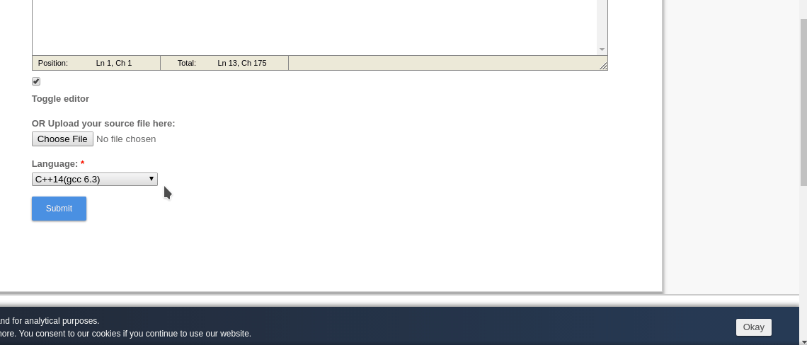

# Coding Shout
Frustrated of staring at your screen waiting for the result of your Codeforces and Codechef submission to pop up? Relax and let this extension notify you as soon as the results appear. It uses text to speech to say the result, or if you prefer being silently notified, there is an option for that too.

Note that it currently doesnot handle System testing.

# Demo

# Installation

### Firefox
Download from [Firefox addons](https://addons.mozilla.org/en-US/firefox/addon/codechef-shout/)

### Chrome

* Click 'Clone or Download' and select 'Download ZIP'
* Extract the zip
* In Chrome go to Options > More tools > Extensions
* Enable developer mode in top right corner
* Click on 'Load unpacked' and select the folder coding_shout

Voila, you have just made your life a lot easier!

Feel free to give some stars. Enjoy coding!
